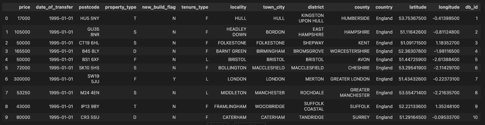
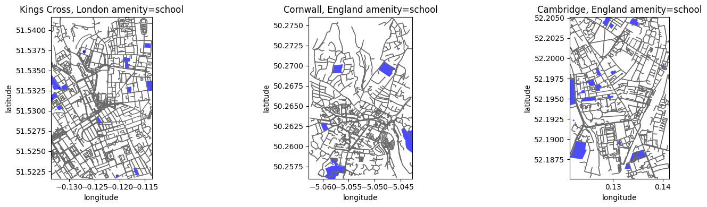
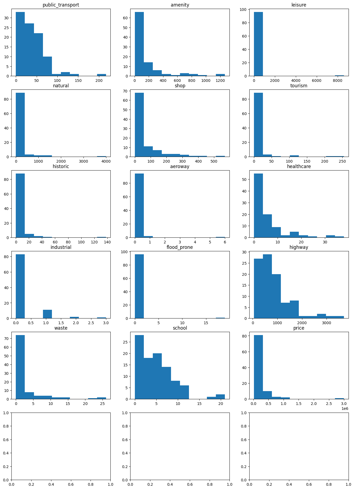
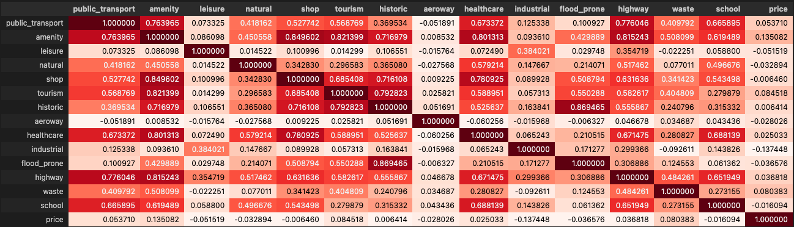
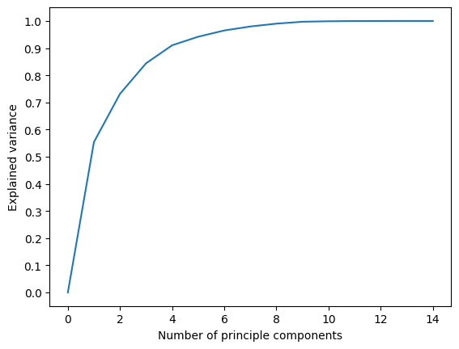
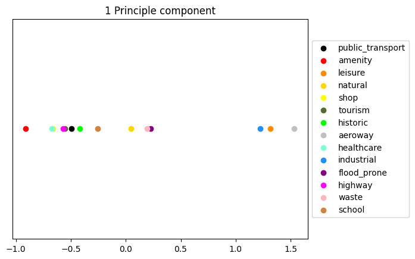
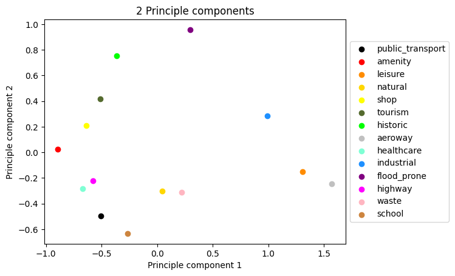
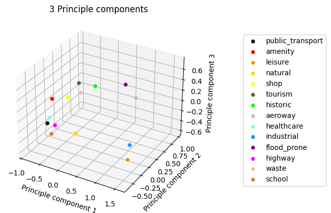
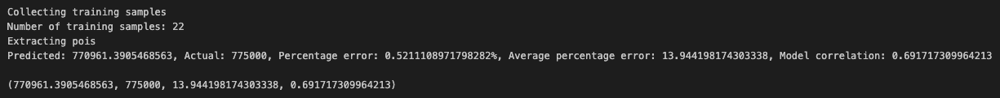

## House price predictions

Below I outline how to make use of my house price prediction system. As part of developing this system I followed the Fynesse framework consisting of 3 stages: address, access and assess. The code has been designed to be as modular as possible to faciliate reuse for different tasks that make use of the same data. For a more in depth demonstration of how the library can be used please refer to the [notebook](https://github.com/Isaac-d22/ADS_final_assignment/blob/main/notebooks/ADS_Report_2268A.ipynb). <br><br>

### Installing libraries
```python
# Install the Fynesse library
%pip install git+https://github.com/Isaac-d22/ADS_final_assignment.git
# Install the following library dependencies
%pip install osmnx
%pip install pymysql
```

## Access
This part of the Fynesse pipeline is concerned with getting the data into a format that allows us to perform feature analysis and extraction. In this case the amount of data we have is too large to simply load it into a pandas dataframe so we make use of a SQL database to store our data.<br>
In particular our assess pipeline has the following functionality:
1. **Downloading files** (both csv and zip) and storing them locally in a user specified directory.
2. **Creating tables and indexes** on these tables.
3. **Populating tables** with the relevant data.
4. **Querying tables** and converting them to dataframes.
5. **Joining tables on postcode** and storing the joined results in a new table to speed up predictions laster on.

### Downloading files
The following code downloads a zip file, extracts it and stores the csv in a postcode_data directory locally.
```python
if not os.path.exists("postcode_data"):
    os.makedirs("postcode_data")
access.download_csv(url="https://www.getthedata.com/downloads/open_postcode_geo.csv.zip", filename="open_postcode_geo.csv.zip", target_dir="postcode_data", extract=True)
```

### Creating a table
The following code creates a prices_coordinates_data table accoridng to the schema specified.
```python
import fynesse.access as access
credentials = access.get_credentials("credentials.yaml")
conn = access.create_connection(user=credentials["username"], 
                                password=credentials["password"], 
                                host=credentials["url"], 
                                port=credentials["port"], 
                                database=credentials["name"])
access.create_prices_coordinates_data(conn)
conn.close()
```

### Populating a table
Simply just specify the file_path of the csv file to upload along with the table_name to populate a table
```python
import fynesse.access as access
credentials = access.get_credentials("credentials.yaml")
conn = access.create_connection(user=credentials["username"], 
                                password=credentials["password"], 
                                host=credentials["url"], 
                                port=credentials["port"], 
                                database=credentials["name"])
access.populate_table(conn=conn, filename=file_path, table=table_name)
conn.close()
```

### Querying a table
```python
import fynesse.access as access
credentials = access.get_credentials("credentials.yaml")
conn = access.create_connection(user=credentials["username"], 
                                password=credentials["password"], 
                                host=credentials["url"], 
                                port=credentials["port"], 
                                database=credentials["name"])
x = access.query_table(conn, 'prices_coordinates_data')
conn.close()
access.price_coordinates_data_to_df(x)
```
Here is the result for the query above:



## Assess
This stage of the pipeline is concerned with asessing the validity of different features and understanding the relationships between them. <br>
In particular, the following functionality is supported:
1. Visualise OSM tags on a map for a given set of locations.
2. Visualise OSM tag counts for a random selection of houses.
3. Visualise the **correlation matrix** for a set of OSM features and prices
4. Conduct **PCA** on a set of OSM features.
5. Visualise the relationships between different features in 1, 2 and 3 principle component dimensions.
### Visualising data
```python
import fynesse.assess as assess
assess.view()
```
Here are the results of running the code above:









## Address
The main purpose of this stage of the Fynesse pipeline is to faciliate making predictions on house prices.<br>
I do this via the following steps:
1. I set a **bounding box** and **date range** that I use to extract a set of house prices to train on that will be relevant to the house I am trying to predict.
2. I then extract releveant **OSM features**  for each house in the training set using a bounding box of **1 km** for each house. 
3. I then merge these OSM features with an encoded set of property features.
4. After this, I use **PCA** to extract an orthogonal feature set that maintains at least 95% of the variance seen in the combined feature set.
5. I then train on these features using either a **linear or ridge regression** depending on what the user specifies.
6. During training I also do **cross validation** to get a sense of how the model perfroms across all houses in the training set and calculate the **average error** and **correlation with house prices** as metrics for this.
7. I then use the trained model and the features for the target house to **predict the target house price**.
### Prediction
Here is an example of how to get a prediction for a detached house in Orpington using a ridge regression with a penalty of 2.
```python
import fynesse.address as address
address.predict_price(latitude=51.363264, longitude=0.090873, date=datetime.date(2022,5,3), property_type='D', penalty=2)
```
Here are the results:
